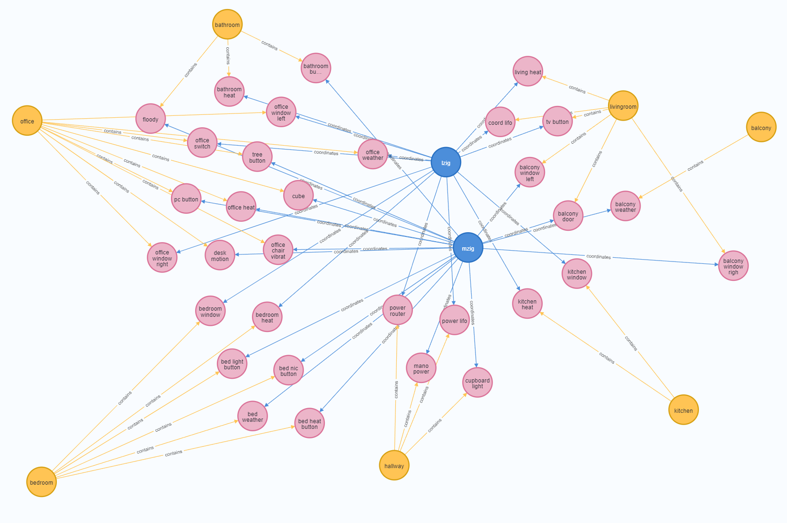

# json to cypher
* graph data formats : comparing multiple representations formats of the same graph, cypher offers an impressively compact and comprehensible notation. Unfortunately, cypher is a domain specific language, therfore automated import and export requires a native json format that offers generic hierarchical maps of lists.
The goal is then to provide utilities that can convers multiple json formats that are conetnt agnostic into cypher.
* native data structures : Applications usually do know the relations between the data structures therefore tend to optimize the data export and do not embed explicit relations in the data structures, that results in a more packed data than if an explicit list of nodes and edges has to be created.


* jsonl : json lines is very effitient when it comes to scale as every line can be processed separately without loading the whole file in memory, such scale is outside of scope of this repo that targets applications that fit and can be processed in memory.
* neo4j ids : althoug neo4j db has a unique id among all Label types, within the export, every Label has its own id scope, that's why when referencing a target within edges, the label has to be provided as well.
* no ids : json data exchanged between applications should not contain app specific number ids because the import or append in an existing database will require assignment of new ids. Additionally, data created manually by users or other apps requires an additional effort to add those ids. Those ids are also meaningless to the nodes information and can clutter it
* unique ids : The scope of these loading utilities is to deal with data where all members of every group can be uniquely identified with one of their properties that is human comprehensible such as name. If such a restriction is not possible, then a custom cypher will have to be written and automated json load cannot be used without given uids. Note that the  name is used by neo4j as a Label (Text visualization) neo4j reserves the Label for the type and uses name instead.
* uid maps, no lists : every group of data should be structured in a map, not a list, where the uid is used as a key
* Labels are the terms used by neo4j for node types. inported data will not take advantage of multi typing capabilities of neo4j. Fallback on a single type allows to pack all data of the same type in a map where the key is the type of the nodes

examples of `Packed json` : see `data\packed.json` and `data\zigbee_packed.json`
```json
{
    "Persons":{
        "Michael":{
            "age": 41,
            "Persons":[
                "Selina",
                "Rana",
                "Selma"
            ]
        },
        "Selina":{},
        "Rana":{},
        "Selma":{}
    }
}
```

examples of `Mapped relations json` : see `data\persons_mapped_relations.json` and `data\programmers_mapped_relations.json`

```json
{
    "Persons":{
        "Michael":{
            "age": 41,
            "knows":{
                "Persons":[
                    "Selina",
                    "Rana",
                    "Selma"
                ],
            },
            "children":{
                "Persons":[
                    "Rana",
                    "Selma"
                ]
            }
        },
        "Selina":{},
        "Rana":{},
        "Selma":{}
    }
}
```

## Packed vs mapped relations
* a `packed json` has minimal footprint and prevents redundancies as names of relations are usually not needed or known by the application using the data
* a `mapped relations` is fully informative with regards to the relationship type, as it adds an extra step of grouping all relationship tapes in a map with the relationship Label as the key
* a `packed json` can hava an optional file separate from the main data that Labels the relationships depending on the source and target

example relations labels see also `data\zigbee_optional_relations.json`
```json
{
  "Persons":{
    "Persons":"knows"
  }
}
```
* only a `mapped relations` allows to have different relationship types between the same node types
* a combination of both `packed json` and `mapped relations` is possible with automated identification depending on the property type (list, map) and its availability in the top node Types map.
* both `packed json` and `mapped relations` can have target relation items as either a list of a map
  * a list a simpler in case the relation does not have any property
  * a map is needed if relatioships do have properties. The key is then the target and the value is a map of properties (see `data\persons_mapped_relations.json` with mapped relations weight)

example packed data laoding `data\zigbee_packed.json` with `data\zigbee_optional_relations.json` see `data\zigbee_relations.cyp` for generated cypher and below is the graph visualization


# neo4j usage
* Cypher : Graph Query Language
* apoc : Awesome Procedures On Cypher
* gds : Graph Data Science

# run
- docker: simply run `./run.sh` which content is
```shell
docker run \
    --name neo_explore \
    -p7474:7474 -p7687:7687 \
    -d \
    -v ${PWD}/neo4j/data:/data \
    -v ${PWD}/neo4j/logs:/logs \
    -v ${PWD}/neo4j/import:/var/lib/neo4j/import \
    -v ${PWD}/neo4j/plugins:/plugins \
    -e NEO4J_AUTH=neo4j/test \
    -e NEO4J_apoc_export_file_enabled=true \
    -e NEO4J_apoc_import_file_enabled=true \
    -e NEO4J_apoc_import_file_use__neo4j__config=true \
    -e NEO4JLABS_PLUGINS=\[\"apoc\",\"graph-data-science\"\] \
    neo4j:latest
```
then open in browser
http://localhost:7474/browser/
- note that as this repo is for test only, it is using a default user and password.

- jupyter lab : should be run from the `python` folder as it is referencing file paths
```shell
$ cd python
$ source venv/bin/activate
python$ jupyter lab
```
then open the provided url with the tocken in the browser
http://localhost:8888/lab?token=9a94cxxxxxxxxxxxd85b002fxxxxxxxxxxxx


# install
- install VSCode plugin `Cypher Query Language`
- install VSCode plugin `JSON Lines`
- install python environment
```shell
cd python
sudo apt install python3.8-venv
sudo apt install python3-pip
python3 -m venv venv
source venv/bin/activate
pip install jupyterlab
```

# issues
running jupyter lab on wsl result in following error which did not prevent further normal usage
`Start : This command cannot be run due to the error: The system cannot find the file specified.`
Fixing this error properly require a complex configuration
# references
install
- https://neo4j.com/developer/docker-run-neo4j/
- https://neo4j.com/labs/apoc/4.1/installation/#docker

list of plugins
- https://neo4j.com/docs/operations-manual/current/docker/operations/#docker-neo4jlabs-plugins

Browser Styling
- https://neo4j.com/docs/browser-manual/current/operations/browser-styling/
```cmd
:style
:style 'file:///style.grass'
```
## Cypher
refcard
- https://neo4j.com/docs/cypher-refcard/current/

manual
- https://neo4j.com/docs/cypher-manual/4.4/introduction/

apoc
- https://neo4j.com/labs/apoc/4.4/

## Graph Data Science
https://neo4j.com/docs/graph-data-science/current/

project params
- https://neo4j.com/docs/graph-data-science/current/graph-project/

FastRP and kNN example
- https://neo4j.com/docs/graph-data-science/current/end-to-end-examples/fastrp-knn-example/

## Python
- limitations (No Numeric utility, no Cypher on GDS on Python) https://neo4j.com/docs/graph-data-science/current/python-client/known-limitations/
- mapping Cypher / Python : https://neo4j.com/docs/graph-data-science/current/python-client/getting-started/#python-client-getting-started-mapping


## Bloom
bloom on docker only for enterprise edition with license as docker param
- https://neo4j.com/docs/bloom-user-guide/current/bloom-installation/advanced-installation/#bloom-docker

