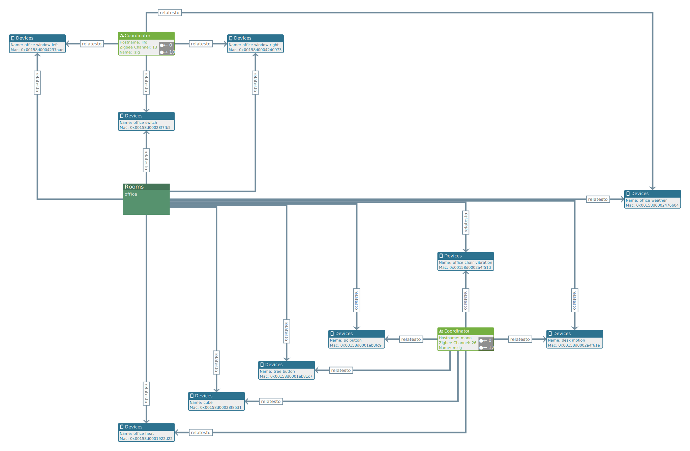

* Cypher : Graph Query Language
* apoc : Awesome Procedures On Cypher
* gds : Graph Data Science

# jupyter lab
should be run from the `python` folder as it is referencing file paths
```shell
$ cd python
$ source venv/bin/activate
python$ jupyter lab
```
then open the provided url with the tocken in the browser
http://localhost:8888/lab?token=9a94cxxxxxxxxxxxd85b002fxxxxxxxxxxxx


# install
- install VSCode plugin `Cypher Query Language`
- install VSCode plugin `JSON Lines`
- install python venv and dependencies

# issues
running jupyter lab on wsl result in following error which did not prevent further normal usage
`Start : This command cannot be run due to the error: The system cannot find the file specified.`
Fixing this error properly require a complex configuration

## Cypher
refcard
- https://neo4j.com/docs/cypher-refcard/current/

manual
- https://neo4j.com/docs/cypher-manual/4.4/introduction/

apoc
- https://neo4j.com/labs/apoc/4.4/

# Neo4j Desktop
* requires name and email to provide a license key for free usage
## yWorks Explorer
* yWorks provide a standalone explorer that also runs as a Neo4J-Desktop plugin
* The explorer has the advantage over bloom of providing shapes that can include the properties of the nodes in a clea visible boxes.
* It can intuitively generate boxes with the node parameters
* It is possible to edit the shapes manually but the editor for that is not very intuitive
* The neighborhood view is missing

https://www.yworks.com/products/data-explorer-for-neo4j

Example Hierarchical Zigbee Home Network

Meta


Hierarchical Layout


## yWorks AI Graph Queries
The editor offer an AI queries generator from text
input sentence
```
the devices related to the office room, show also the office room and all of the coordinators
```

It does the trick, the result is as expected, so the test is successfull. The executed query or the history is not visible to the user though for future direct usage of the queries.



Only graph queries are generated, queries related to layout changes are not understood.

